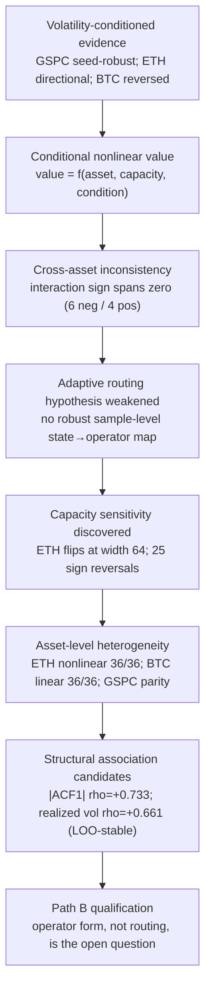

# 08 · Evidence Chain

Per spec §11 and §15. Each arrow is a claim; each claim is annotated with the evidence that
supports it and with its confidence. Where the data does **not** support a step, the step is
marked as such rather than kept for narrative convenience.

## Step-by-step support

| Step | Claim | Supporting evidence | Status | Confidence |
|---|---|---|---|---|
| A | Volatility conditions the outcome, at least in some assets | GSPC both seeds supported negative interaction; ETH negative but inconclusive; BTC supported positive | ✅ as stated (asset-dependent) | high |
| B | Nonlinear value is conditional | framework-level gains differ by asset (11.1%/15.4% vs 2.4% vs 1.8%); proxy preference differs by asset and capacity | ✅ | moderate-high |
| C | The relation is not universal | 10 assets: 6 negative / 4 positive; 5 supported | ✅ | high |
| D | Sample-level routing is not supported | 12 states; GSPC/BTC linear in 12/12; ETH flip is asset-wide; consistency degrades with capacity | ✅ **negative result** | high |
| E | Capacity materially affects the observed preference | width sweep 23/64/128; 25 reversals (23 ETH, 8 GSPC-all-seed-2023); per-seed consistency 31→29→28/36 | ✅ | high that capacity matters, low on mechanism |
| F | Operator preference is an asset-level property | ETH 36/36 nonlinear at widths 64 and 128; BTC 36/36 linear at all widths; GSPC near parity at 128 | ✅ (3 assets) | moderate-high |
| G | Two structural features are candidate explanations | `|ACF1|` ρ=+0.733 (p=0.016), realized vol ρ=+0.661 (p=0.038), LOO-stable; GSPC-merge insensitive | ⚠️ **candidate only** | moderate |
| H | The open question is the operator, not the router | routing unsupported (D) while heterogeneity is supported (F) | ✅ as a research direction | moderate-high |

## Where the chain is deliberately *not* drawn

- **No arrow from "capacity sensitivity" to "representation bottleneck".** The evidence cannot
  separate under-capacity from intrinsic unsuitability; the permitted wording is
  *"capacity sensitivity is a major uncertainty / confounder"*.
- **No arrow from "structural association" to "mechanism".** The two candidate features are
  exploratory rank associations with N = 10; the spec forbids describing them as causal.
- **No arrow to "NS is needed".** The chain ends at *Path B qualification* — i.e. the next
  hypothesis worth testing is about a structured nonlinear operator, which is not the same as
  saying that any particular operator family works.
